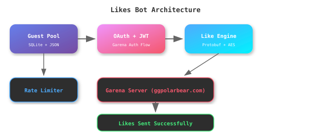

<div align="center">


</div>

---

## 📋 Table of Contents

| # | Section |
|---|---------|
| 1 | [Overview](#-overview) |
| 2 | [Features](#-features) |
| 3 | [Installation](#-installation) |
| 4 | [Usage](#-usage) |
| 5 | [Architecture](#-architecture) |
| 6 | [Configuration](#-configuration) |
| 7 | [Project Structure](#-project-structure) |
| 8 | [FAQ](#-faq) |

---

## 👋 Overview

**FreeFire Likes Bot** is a multi-guest like sender for Free Fire — it uses guest accounts to send likes to any target player. Built with async HTTP, AES-256 encryption, and protobuf packets. Optimized for Termux on Android.

---

## ✨ Features

| Feature | Description |
|---------|-------------|
| 🎯 **Multi-Guest Likes** | Send likes from multiple guest accounts to a target UID |
| 🔄 **Auto-Auth** | OAuth → MajorLogin → JWT token flow per guest |
| 🔐 **AES-256** | All packets encrypted with Garena's encryption scheme |
| 📡 **Protobuf** | LikeProfile packets built using compiled protobuf |
| ⚡ **Rate Limiting** | Configurable rate limits with burst support |
| 🔁 **Streak Engine** | Send multiple likes per guest with cooldown |
| 🌐 **Multi-Region** | BD, IND, US, ME (MENA) server support |
| 📱 **Termux Ready** | One-command setup script for Android |
| 💾 **Guest Manager** | SQLite + JSON storage for guest accounts |
| 📊 **Logging** | Rich console logging with file output |

---

## 📦 Installation

<details open>
<summary><b>Termux (Android)</b></summary>

<br>

```bash
# Clone the repo
git clone https://github.com/ISMAILdz13/FreeFireLikesBot.git
cd FreeFireLikesBot

# Run the setup script
bash SETUP_TERMUX.sh

# OR install manually
pkg install python python-pip
pip install httpx[http2] pycryptodome protobuf aiosqlite pyyaml pydantic rich typer anyio
```

</details>

<details>
<summary><b>Linux / macOS</b></summary>

<br>

```bash
git clone https://github.com/ISMAILdz13/FreeFireLikesBot.git
cd FreeFireLikesBot
pip install -r requirements.txt
```

</details>

---

## 🎮 Usage

```bash
# Send 15 likes to a target UID
python3 run_likes.py --target 3476575559 --count 15 --region ME

# Send 30 likes with 5 per guest
python3 run_likes.py --target 3476575559 --count 30 --region ME --per-guest 5

# Send 100 likes with proxy rotation
python3 run_likes.py --target 3476575559 --count 100 --region ME --use-proxy

# Add more guest accounts
python3 add_guest.py
```

### Arguments

| Argument | Default | Description |
|----------|---------|-------------|
| `--target` | Required | Target player UID |
| `--count` | 15 | Total likes to send |
| `--per-guest` | 3 | Likes per guest before rotating |
| `--region` | ME | Server region (ME, BD, IND, US) |
| `--use-proxy` | false | Enable proxy rotation |

---

## 🏗️ Architecture



### How It Works

1. **Guest Pool** — Load guest accounts from SQLite/JSON
2. **Auth Flow** — Each guest: OAuth login → MajorLogin → JWT token
3. **Like Engine** — Build LikeProfile protobuf packet, encrypt with AES-256
4. **Send** — POST to `clientbp.ggpolarbear.com:443`
5. **Rotate** — After N likes per guest, switch to next guest
6. **Rate Limit** — Enforce cooldowns to avoid detection

---

## ⚙️ Configuration

Edit `config/settings.yaml`:

```yaml
bot:
  name: "FF-LikeBot-Pro"
  max_workers: 1

server:
  target_region: "ME"
  game_version: "OB54"

encryption:
  main_key: "Yg&tc%DEuh6%Zc^8"
  main_iv: "6oyZDr22E3ychjM%"

rate_limiting:
  requests_per_second: 8
  guest_cooldown_seconds: 5
  target_daily_limit: 500

streak:
  default_count: 100
  delay_between_likes_ms: 10000
```

Edit `data/guests.json` with your guest accounts:
```json
[
  {
    "uid": "YOUR_GUEST_UID",
    "password": "YOUR_GUEST_PASSWORD",
    "region": "ME"
  }
]
```

---

## 📁 Project Structure

```
FreeFireLikesBot/
├── run_likes.py              # Main entry point — CLI like sender
├── add_guest.py              # Add guest accounts interactively
├── SETUP_TERMUX.sh           # One-command Termux setup
├── requirements.txt          # Python dependencies
├── config/
│   ├── settings.yaml         # Bot configuration
│   └── regions.yaml          # Server endpoints per region
├── data/
│   └── guests.json           # Guest account credentials
├── src/
│   ├── auth/
│   │   └── jwt_manager.py    # Garena OAuth + JWT flow
│   ├── core/
│   │   ├── bot.py             # Core bot logic
│   │   ├── config_loader.py   # YAML config loader
│   │   └── logger.py          # Rich logging setup
│   ├── crypto/
│   │   └── aes_engine.py      # AES-256 encryption
│   ├── guests/
│   │   ├── generator.py       # Guest account generator
│   │   ├── importer.py        # Import from external sources
│   │   └── manager.py         # Guest pool management
│   ├── likes/
│   │   ├── sender.py          # LikeProfile packet sender
│   │   └── streak_engine.py   # Multi-like streak logic
│   ├── network/
│   │   ├── http_client.py     # Async HTTP client (httpx)
│   │   └── proxy_rotator.py   # Proxy rotation manager
│   └── proto/
│       ├── freefire.proto     # Protobuf definitions
│       └── compiled/          # Compiled protobuf files
├── assets/                    # README SVGs
├── LICENSE
└── .gitignore
```

---

## ❓ FAQ

<details>
<summary><b>What regions are supported?</b></summary>

BD (Bangladesh), IND (India), US, ME (Middle East/North Africa). Default is ME.

</details>

<details>
<summary><b>How do I add guest accounts?</b></summary>

Run `python3 add_guest.py` and enter UID + password. Or edit `data/guests.json` directly.

</details>

<details>
<summary><b>Does it work on free Termux?</b></summary>

Yes! All requests use HTTPS port 443, which works on free plans. No special network access needed.

</details>

<details>
<summary><b>How does the encryption work?</b></summary>

Packets are encrypted with AES-256-CBC using keys extracted from the game client. The main key/IV are in `config/settings.yaml`.

</details>

---

## 👤 Credits

- **Developer**: ISMAILdz13 (@ISMAILdz13)
- **Repository**: [github.com/ISMAILdz13/FreeFireLikesBot](https://github.com/ISMAILdz13/FreeFireLikesBot)

## 📄 License

MIT License — see [LICENSE](LICENSE) file.

---

<div align="center">
<sub>⭐ Star this repo if it helps you</sub>
</div>

## Like Route Tester (phone/network diagnostic)

Some Garena like clusters are geo-gated: they ignore cloud/datacenter IPs but answer from local mobile IPs. This tester checks every known route **from your own network** and tells you exactly which one delivers real likes:

```bash
python3 tools/test_like_routes.py [TARGET_UID]
```

It logs in with a guest, reads the target's like count, fires one like over every route (all clusters, static + session encryption), then re-reads the count and prints a clear verdict. If it counts — send the output to the agent so the bot gets pointed at that route permanently.

## Site Delivery Mode (RECOMMENDED — direct method is dead)

Garena's anti-bot now silently drops direct HTTP like requests from every IP
(verified from cloud + mobile networks). The bot therefore supports delivering
through your own ff-like.noobs-api.top API:

```bash
# one-time: save your API key (from your dashboard -> API Keys)
echo -n "noobs_XXXXYOURKEY" > data/site_api_key.txt

# send 100 likes to a UID
python3 run_likes.py --site --target 3476575559 --count 100

# bigger packages: --count 120 or 220 (costs more API credits)
```

The response prints real before/after like counts — that IS the verification.

## v2.4 — Site delivery via dashboard JWT (no API key needed!)
`python3 run_likes.py --site --target <UID> --count 100 --server mena`

- Auth: save your site JWT (from localStorage `ff_jwt_token` after Google login) to `data/site_jwt.txt` — Prime 1 account works, no API key required.
- Falls back to `data/site_api_key.txt` (Prime 3 API key) automatically.
- Servers: bd ind mena na pk id sg th (default: mena).
- Dashboard route has a 100-likes/day per-UID limit — for more, create a **slot** in the site dashboard (100/120/220 likes per day for 15/30 days, delivered automatically server-side).
